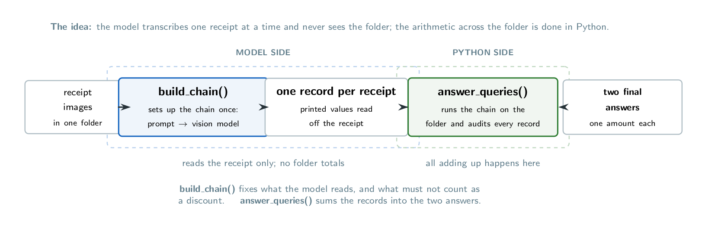

# FTEC5660 Homework 1: Receipt Chain

Build a LangChain pipeline that reads every supermarket receipt in a folder
with the vision-capable DeepSeek Flash model and answers these two questions:

1. How much money did I spend in total for these bills?
2. How much would I have had to pay without the discount?

For this homework, **amount spent** means the final payment after the receipt's
rounding line. **Without the discount** means the sum of the original positive
item prices: add back every promotion, coupon, member, app, packaging-damage,
and percentage discount, but do not add back rounding.

## Student task

Only edit the two functions in `hw1.py` that contain `### YOUR CODE HERE`:

- `build_chain()` creates your LangChain chain.
- `answer_queries()` runs the chain on the receipt images and returns one final
  response for each question.

You may use prompt chaining, routing, parallel calls, reflection, or a
combination. Your final responses should each contain one HKD amount. Do not
hard-code filenames or public answers; grading uses unseen receipt folders.

## Setup and public test

```bash
python3 -m venv .venv
source .venv/bin/activate
pip install -r requirements.txt
```

Put your DeepSeek key after `DEEPSEEK_API_KEY=` in `.env`, then run:

```bash
python3 hw1.py --image-folder public_test
```

The program creates `results.csv` in the current directory. Its columns are
`query`, `model_response`, and `correctness`. The public answers are in
`public_test/ground_truth.json`. The starter intentionally returns the dummy
response `please design your chain to answer these two queries.` so it runs
before you add any API code.

The required model is `deepseek-v4-flash-vision-exp`, the vision-capable
DeepSeek Flash model. JPEG, PNG, GIF, and WebP inputs are accepted by the
homework runner.


## Homework 1 solution: 



The design splits the work across the two functions. `build_chain()` sets up the model and
prompt once, and the prompt asks the vision model to do nothing but read one receipt: it
returns that receipt's figures in the same shape as `ground_truth.json`
(`subtotal_after_discounts_before_rounding`, `discount_lines`, `discount_total`,
`amount_paid_after_rounding`, `amount_without_discounts`), with every discount written as a
positive number so `discount_total` is a plain sum, and with the non-discounts named
explicitly (the rounding line, the plastic-bag surcharge, change, and points balances). The
prompt also warns the model never to copy a number out of a promotion label, but to read the true discount price column. `answer_queries()` then batches the chain over the whole
folder, rejects any record that is not JSON or that cannot describe a real receipt (missing
fields, a non-positive subtotal or payment, a subtotal-to-payment gap too large to be
rounding) by returning `unreadable receipt(s): ...` rather than a total that is quietly
missing a receipt, and finally sums `amount_paid_after_rounding` for question 1 and
`amount_without_discounts` for question 2 in `Decimal`. Each response is the bare amount
(`HK$1974.30`), because the runner extracts the single number from the text.

**Result.** `python hw1.py --image-folder public_test` gives `HK$1974.30` and `HK$2348.20`,
both `correct` in `results.csv`.

